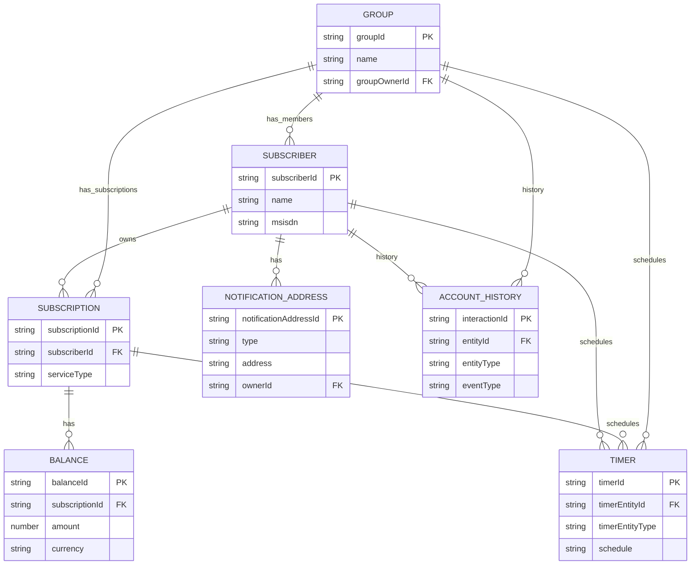

# Data model — entity relations

This document summarizes the main entities, their key attributes and relationships as defined by the API schema [`components.schemas.*`](ocs-provisioing-api.yml#components.schemas) and the example JSON instances in this workspace.

Referenced schemas
- [`components.schemas.Subscriber`](ocs-provisioing-api.yml#components.schemas.Subscriber) — [ocs-provisioing-api.yml](ocs-provisioing-api.yml) / example: [subscriber.json](subscriber.json)
- [`components.schemas.Subscription`](ocs-provisioing-api.yml#components.schemas.Subscription) — [ocs-provisioing-api.yml](ocs-provisioing-api.yml) / example: [subscription.json](subscription.json)
- [`components.schemas.Balance`](ocs-provisioing-api.yml#components.schemas.Balance) — [ocs-provisioing-api.yml](ocs-provisioing-api.yml) / example: [balance.json](balance.json)
- [`components.schemas.Group`](ocs-provisioing-api.yml#components.schemas.Group) — [ocs-provisioing-api.yml](ocs-provisioing-api.yml) / example: [group.json](group.json)
- [`components.schemas.NotificationAddress`](ocs-provisioing-api.yml#components.schemas.NotificationAddress) — [ocs-provisioing-api.yml](ocs-provisioing-api.yml) / example: [notificationAddress.json](notificationAddress.json)
- [`components.schemas.Timer`](ocs-provisioing-api.yml#components.schemas.Timer) — [ocs-provisioing-api.yml](ocs-provisioing-api.yml) / example: [timer.json](timer.json)
- [`components.schemas.AccountHistory`](ocs-provisioing-api.yml#components.schemas.AccountHistory) — [ocs-provisioing-api.yml](ocs-provisioing-api.yml) / example: [accountHistory.json](accountHistory.json)

Overview
- Subscriber is a top-level actor. A Subscriber may own subscriptions, notification addresses, belong to groups and have timers and account history entries.
  - Example instance: [subscriber.json](subscriber.json)
  - Schema: [`components.schemas.Subscriber`](ocs-provisioing-api.yml#components.schemas.Subscriber)

- Subscription belongs to a Subscriber (has `subscriberId`) and can have Balances and Timers.
  - Example instance: [subscription.json](subscription.json)
  - Schema: [`components.schemas.Subscription`](ocs-provisioing-api.yml#components.schemas.Subscription)

- Balance belongs to a Subscription (has `subscriptionId`). Balances track amounts, rollovers and recurring cycle metadata.
  - Example instance: [balance.json](balance.json)
  - Schema: [`components.schemas.Balance`](ocs-provisioing-api.yml#components.schemas.Balance)
  - Key enums:
    - `balanceType`: ALLOWANCE, COUNTER
    - `unitType`: BYTES, SECONDS, EVENTS, MICROCENTS, MICROUNITS
    - `cycleLengthType`: days, months, years

- Group is a collection of Subscribers (`members`) with an owner (`groupOwner`) and may include Subscriptions, NotificationAddresses and Timers.
  - Example instance: [group.json](group.json)
  - Schema: [`components.schemas.Group`](ocs-provisioing-api.yml#components.schemas.Group)

- NotificationAddress represents a contact endpoint (SMS / EMAIL). NotificationAddresses can be created for Subscribers or Groups and are referenced by ID.
  - Example instance: [notificationAddress.json](notificationAddress.json)
  - Schema: [`components.schemas.NotificationAddress`](ocs-provisioing-api.yml#components.schemas.NotificationAddress)

- Timer is an attached scheduled object. Timers are created in the context of a Subscriber, Subscription or Group (endpoints enforce scoping). Timers reference an entity via `timerEntityId` and have execution metadata.
  - Example instance: [timer.json](timer.json)
  - Schema: [`components.schemas.Timer`](ocs-provisioing-api.yml#components.schemas.Timer)

- AccountHistory records interactions related to an entity (Subscriber, Group, Account). Each entry references `entityId` + `entityType` and is uniquely identified by `interactionId`.
  - Example instance: [accountHistory.json](accountHistory.json)
  - Schema: [`components.schemas.AccountHistory`](ocs-provisioing-api.yml#components.schemas.AccountHistory)

Primary relations (summary)
- Subscriber 1 — * Subscription
  - Subscription.subscriptionId references a subscription; Subscription.subscriberId = Subscriber.subscriberId.
  - Endpoint surfaces: GET [/subscribers/{subscriberId}/subscriptions](ocs-provisioing-api.yml#paths./subscribers/%7BsubscriberId%7D/subscriptions) and POST [/subscriptions](ocs-provisioing-api.yml#paths./subscriptions)

- Subscription 1 — * Balance
  - Balance.subscriptionId = Subscription.subscriptionId.
  - Endpoint surfaces: GET [/subscriptions/{subscriptionId}/balances](ocs-provisioing-api.yml#paths./subscriptions/%7BsubscriptionId%7D/balances) and POST [/subscriptions/{subscriptionId}/balances](ocs-provisioing-api.yml#paths./subscriptions/%7BsubscriptionId%7D/balances)

- Subscriber 1 — * NotificationAddress
  - Notification addresses scoped to a subscriber: [/subscribers/{subscriberId}/notificationAddresses](ocs-provisioing-api.yml#paths./subscribers/%7BsubscriberId%7D/notificationAddresses)
  - Global endpoints exist for creation/lookup by ID: [/notificationAddresses](ocs-provisioing-api.yml#paths./notificationAddresses) and [/notificationAddresses/{notificationAddressId}](ocs-provisioing-api.yml#paths./notificationAddresses/%7BnotificationAddressId%7D)

- Group 1 — * Member (Subscriber)
  - Group.members is an array of subscriber IDs.
  - Group.groupOwner.subscriberId denotes the owner.

  - See Group endpoints: [/groups](ocs-provisioing-api.yml#paths./groups) and [/groups/{groupId}](ocs-provisioing-api.yml#paths./groups/%7BgroupId%7D) and members endpoints [/groups/{groupId}/members](ocs-provisioing-api.yml#paths./groups/%7BgroupId%7D/members)

- Group 1 — * Subscription (optional association)
  - Group.subscriptions holds subscription IDs that are logically linked to the group (see Group schema: [`components.schemas.Group`](ocs-provisioing-api.yml#components.schemas.Group)).

- (Subscriber | Subscription | Group) 1 — * Timer
  - Timers are scoped (endpoints for subscriber, subscription, group timers) or created globally via [/timers](ocs-provisioing-api.yml#paths./timers) then associated through `timerEntityId`.
  - Scoped timer endpoints: [/subscribers/{subscriberId}/timers](ocs-provisioing-api.yml#paths./subscribers/%7BsubscriberId%7D/timers), [/subscriptions/{subscriptionId}/timers](ocs-provisioing-api.yml#paths./subscriptions/%7BsubscriptionId%7D/timers) and [/groups/{groupId}/timers](ocs-provisioing-api.yml#paths./groups/%7BgroupId%7D/timers)

- Entity 1 — * AccountHistory
  - AccountHistory.entityId + entityType link entries to the owner entity (Subscriber, Group, Account).
  - Endpoints: create/list by entity: [/accountHistory](ocs-provisioing-api.yml#paths./accountHistory) and [/accountHistory/{entityId}](ocs-provisioing-api.yml#paths./accountHistory/%7BentityId%7D). Get by interactionId: [/accountHistory/{interactionId}](ocs-provisioing-api.yml#paths./accountHistory/%7BinteractionId%7D)

## ER diagram (Mermaid)

Below is an ER-format diagram rendered with Mermaid's `erDiagram` syntax. It captures primary entities, their key attributes (PK = primary key, FK = foreign key) and cardinality.



Cardinality and constraints
- Keys
  - Subscriber.subscriberId — primary identifier for Subscriber.
  - Subscription.subscriptionId — primary identifier for Subscription.
  - Balance.balanceId — primary identifier for Balance.
  - Group.groupId — primary identifier for Group.
  - NotificationAddress.notificationAddressId — primary identifier for NotificationAddress.
  - Timer.timerId — primary identifier for Timer.

    ## PlantUML class diagram

    Below is a PlantUML class diagram (detailed) generated from the OpenAPI schemas. You can render `diagram.puml` with PlantUML or include the inline PlantUML below in any renderer that supports PlantUML.

    File: `diagram.puml` (generated)

    ```plantuml
    @startuml
    package "Entities" {
      class Subscriber {
        +subscriberId : String
        msisdn : String
        imsi : String
        iccId : String
        currentState : String
        creationDate : DateTime
        --
        firstName : String
        lastName : String
        email : String
      }

      class Subscription {
        +subscriptionId : String
        subscriberId : String
        subscriptionType : String
        offerId : String
        state : String
        creationDate : DateTime
        activationDate : DateTime
        recurring : Boolean
      }

      class Balance {
        +balanceId : String
        subscriptionId : String
        balanceType : String
        unitType : String
        balanceAmount : Double
        balanceAvailable : Double
        effectiveDate : DateTime
        expirationDate : DateTime
      }

      class Group {
        +groupId : String
        groupName : String
        groupType : String
        state : String
        createdDate : DateTime
        groupOwnerSubscriberId : String
        maxMembers : Integer
      }

      class NotificationAddress {
        +notificationAddressId : String
        notificationType : String
        notificationAddress : String
        createdDate : DateTime
      }

      class Timer {
        +timerId : String
        timerEntityId : String
        timerName : String
        timerExecutionDate : DateTime
        timerExecutionRelativePeriod : Integer
        createdDate : DateTime
      }

      class AccountHistory {
        +interactionId : String
        entityId : String
        entityType : String
        creationDate : DateTime
        description : String
        status : String
      }
    }

    ' Associations / cardinality
    Subscriber "1" -- "0..*" Subscription : owns
    Subscription "1" -- "0..*" Balance : has
    Group "1" -- "0..*" Subscriber : has_members
    Group "1" -- "0..*" Subscription : has_subscriptions
    Subscriber "1" -- "0..*" NotificationAddress : has

    ' Timers are associated to an entity (Subscriber / Subscription / Group) via timerEntityId
    Timer "0..*" --> "1" Subscriber : "timerEntityId = subscriberId (optional)"
    Timer "0..*" --> "1" Subscription : "timerEntityId = subscriptionId (optional)"
    Timer "0..*" --> "1" Group : "timerEntityId = groupId (optional)"

    ' AccountHistory entries relate to entities (subscriber/group/account)
    AccountHistory "0..*" --> "1" Subscriber : "entityId when entityType=SUBSCRIBER"
    AccountHistory "0..*" --> "1" Group : "entityId when entityType=GROUP"

    @enduml
    ```

    Rendering notes
    - To render locally, install PlantUML and Graphviz and run:

    ```bash
    plantuml diagram.puml
    ```

    This will output `diagram.png` and/or `diagram.svg` depending on your PlantUML setup. Alternatively VS Code extensions (PlantUML) can preview and export the diagram.

    If you'd like I can render the diagram to PNG or SVG and add it to the repo (or attach it here). Let me know which format you prefer.
  - AccountHistory.interactionId — primary identifier for AccountHistory entry.

- Uniqueness / uniqueness constraints implied by API
  - NotificationAddress.notificationAddress should be unique per scope (subscriber or group) according to endpoint descriptions.
  - Examples show conflict responses for duplicate resources (409) — see examples in [ocs-provisioing-api.yml](ocs-provisioing-api.yml) (e.g. ConflictDuplicateNotificationAddress).

Endpoint mapping (where to retrieve lists / single entities)
- Subscriber
  - Create: POST /subscribers/ (see [`/subscribers/`](ocs-provisioing-api.yml#paths./subscribers/))
  - Get: GET /subscribers/{subscriberId} (see [`/subscribers/{subscriberId}`](ocs-provisioing-api.yml#paths./subscribers/%7BsubscriberId%7D))

- Subscription
  - Create (scoped): POST /subscribers/{subscriberId}/subscriptions
  - Get: GET /subscriptions/{subscriptionId} (see [`/subscriptions/{subscriptionId}`](ocs-provisioing-api.yml#paths./subscriptions/%7BsubscriptionId%7D))
  - List for subscriber: GET /subscribers/{subscriberId}/subscriptions

- Balance
  - List / Create / Delete under subscription: /subscriptions/{subscriptionId}/balances

- Group
  - Create: POST /groups
  - Get: GET /groups/{groupId}

- NotificationAddress
  - Create (scoped): POST /subscribers/{subscriberId}/notificationAddresses or POST /groups/{groupId}/notificationAddresses
  - Global create: POST /notificationAddresses
  - Get by id: GET /notificationAddresses/{notificationAddressId} or GET /subscribers/{subscriberId}/notificationAddresses/{notificationAddressId}

- Timer
  - Create / list scoped: /subscribers/{subscriberId}/timers, /subscriptions/{subscriptionId}/timers, /groups/{groupId}/timers
  - Global create: POST /timers
  - Get by id: GET /timers/{timerId}

- AccountHistory
  - Create: POST /accountHistory
  - List for entity: GET /accountHistory/{entityId}
  - Get by interactionId: GET /accountHistory/{interactionId}

Examples (local files)
- Subscriber example: [subscriber.json](subscriber.json)
- Subscription example: [subscription.json](subscription.json)
- Balance example: [balance.json](balance.json)
- Group example: [group.json](group.json)
- NotificationAddress example: [notificationAddress.json](notificationAddress.json)
- Timer example: [timer.json](timer.json)
- AccountHistory example: [accountHistory.json](accountHistory.json)

Notes & migration guidance
- Top-level collection GET endpoints that returned full lists have been removed (see changelog: [CHANGELOG.md](CHANGELOG.md) and API info in [ocs-provisioing-api.yml](ocs-provisioing-api.yml)). Prefer scoped endpoints with pagination (limit/offset) such as GET /subscribers/{subscriberId}/subscriptions or GET /accountHistory/{entityId}.

If you want a diagram (ER or Mermaid) or a compact JSON Schema cross-reference table, say which format to generate and it will be added.